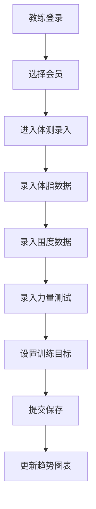
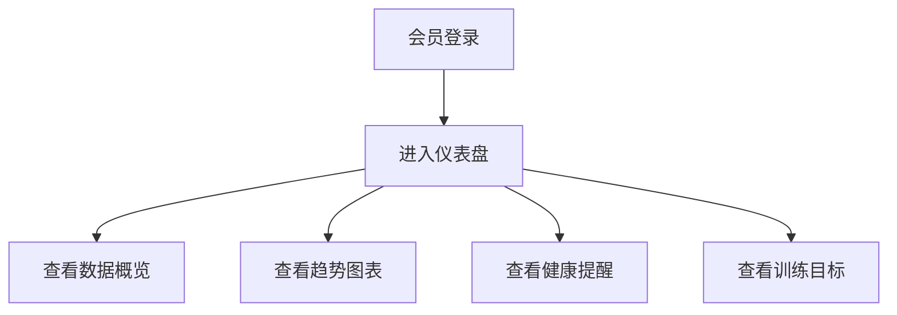
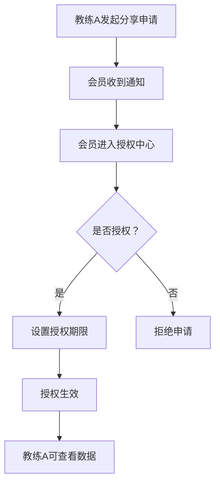

## 1. 产品概述

健身房会员体测趋势台是一款专业的健身数据管理平台，帮助教练记录会员的体脂、围度、力量测试等体测数据，让会员直观了解训练效果和身体变化趋势，同时支持数据分享授权和后台统计分析。

- **核心价值**：数字化管理体测数据，可视化展示训练效果，提升会员粘性和教练工作效率
- **目标用户**：健身教练、健身房会员、健身房管理者

## 2. 核心功能

### 2.1 用户角色

| 角色 | 登录方式 | 核心权限 |
|------|----------|----------|
| 教练 | 账号登录 | 录入体测数据、查看会员趋势、申请数据分享、管理训练目标 |
| 会员 | 账号登录 | 查看个人体测趋势、授权数据分享、设置训练目标 |
| 管理员 | 后台登录 | 按课程/教练查看整体改善情况、用户管理 |

### 2.2 功能模块

1. **登录页**：角色选择、账号登录
2. **教练工作台**：会员列表、体测录入、数据趋势查看
3. **会员仪表盘**：体测趋势图表、阶段变化对比、健康提醒
4. **数据分享授权**：分享申请管理、授权/拒绝操作
5. **后台管理**：按课程统计、按教练统计、整体改善分析

### 2.3 页面详情

| 页面名称 | 模块名称 | 功能描述 |
|-----------|-------------|---------------------|
| 登录页 | 角色切换 | 教练/会员/管理员三种角色切换登录 |
| 登录页 | 登录表单 | 账号密码输入、记住登录、忘记密码 |
| 教练工作台 | 会员列表 | 搜索、筛选、快速录入入口 |
| 教练工作台 | 体测录入 | 体脂数据、围度数据、力量测试、训练目标录入 |
| 教练工作台 | 趋势图表 | 多维度数据折线图、阶段对比 |
| 教练工作台 | 分享申请 | 向其他教练发起数据分享申请 |
| 会员仪表盘 | 概览卡片 | 最新体测数据概览、变化幅度展示 |
| 会员仪表盘 | 趋势图表 | 体脂率、体重、围度等趋势曲线图 |
| 会员仪表盘 | 健康提醒 | 异常指标健康提醒（非诊断） |
| 会员仪表盘 | 训练目标 | 目标设置、完成进度 |
| 授权中心 | 申请列表 | 待处理的分享申请列表 |
| 授权中心 | 授权管理 | 同意/拒绝、授权期限设置 |
| 后台管理 | 课程统计 | 按课程查看会员整体改善情况 |
| 后台管理 | 教练统计 | 按教练查看学员整体改善数据 |
| 后台管理 | 数据看板 | 综合数据仪表盘、趋势分析 |

## 3. 核心流程

### 3.1 教练录入体测数据流程

教练登录后选择会员，进入体测录入页面，依次录入体脂数据、围度数据、力量测试数据和训练目标，提交后系统自动保存并更新趋势图表。

### 3.2 会员查看体测趋势流程

会员登录后进入仪表盘，查看最新体测数据概览和各维度趋势图表，查看健康提醒和训练目标完成情况。

### 3.3 数据分享授权流程

教练A申请查看会员数据，会员收到申请通知，在授权中心审核后决定是否授权，授权后教练A可查看该会员的体测数据。

## 4. 用户界面设计

### 4.1 设计风格

- **主色调**：清新翠绿（#10B981）- 代表健康、活力、成长
- **辅助色**：深海蓝（#0EA5E9）- 代表专业、信任
- **警示色**：暖橙色（#F59E0B）- 用于健康提醒
- **背景**：浅灰渐变底色，营造干净清爽的医疗健康感
- **按钮风格**：圆角胶囊型按钮，带有微妙的悬停上浮动效
- **字体**：主标题使用现代无衬线字体，正文使用清晰易读的字体
- **布局风格**：卡片式布局，柔和阴影，层次分明
- **图标风格**：线性图标，简洁现代

### 4.2 页面设计概览

| 页面名称 | 模块名称 | UI元素 |
|-----------|-------------|-------------|
| 登录页 | 登录卡片 | 渐变背景、浮动卡片、角色切换标签、流畅过渡动画 |
| 教练工作台 | 侧边导航 | 暗色侧边栏、高亮选中项、图标+文字 |
| 教练工作台 | 数据录入表单 | 分组表单、步进式录入、实时验证 |
| 会员仪表盘 | 概览卡片 | 渐变卡片、数据动画、趋势箭头 |
| 会员仪表盘 | 图表区域 | 交互式折线图、多维度切换、悬停数据点 |
| 授权中心 | 申请卡片 | 头像信息、操作按钮、状态标签 |
| 后台管理 | 数据看板 | 多种图表组件、筛选器、数据表格 |

### 4.3 响应式设计

- **设计策略**：桌面端优先，移动端自适应
- **断点设置**：1024px（平板）、768px（手机）
- **移动端优化**：侧边栏转为底部导航、卡片堆叠布局、触控友好按钮

### 4.4 动效设计

- 页面切换：淡入淡出 + 轻微位移动效
- 数据加载：骨架屏 + 渐入效果
- 图表数据：数字滚动动画
- 卡片悬停：轻微上浮 + 阴影加深
- 按钮交互：点击缩放反馈
