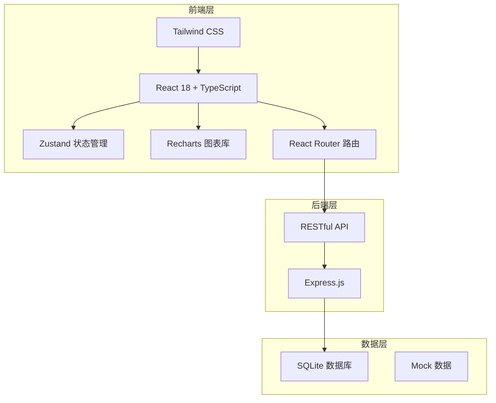
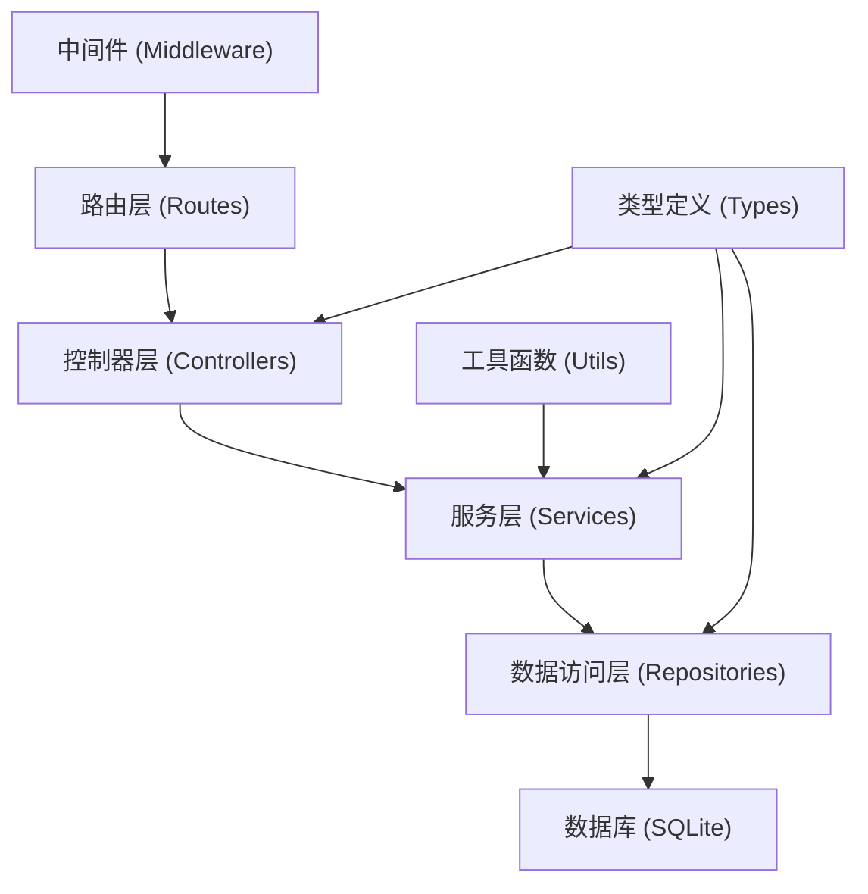
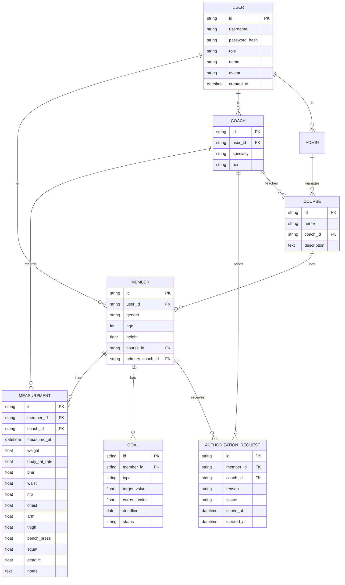

## 1. 架构设计



## 2. 技术描述

- **前端框架**：React 18 + TypeScript + Vite
- **样式方案**：Tailwind CSS 3
- **状态管理**：Zustand
- **图表库**：Recharts
- **路由管理**：React Router DOM
- **图标库**：Lucide React
- **后端框架**：Express.js 4
- **数据库**：SQLite（开发阶段使用 mock 数据）
- **初始化工具**：vite-init
- **包管理器**：npm

## 3. 路由定义

| 路由路径 | 页面用途 | 角色权限 |
|---------|---------|---------|
| /login | 登录页面 | 公开 |
| /coach | 教练工作台首页 | 教练 |
| /coach/members | 会员列表 | 教练 |
| /coach/members/:id | 会员详情/体测录入 | 教练 |
| /coach/trends | 趋势分析 | 教练 |
| /member | 会员仪表盘首页 | 会员 |
| /member/trends | 体测趋势 | 会员 |
| /member/goals | 训练目标 | 会员 |
| /member/authorization | 授权中心 | 会员 |
| /admin | 后台管理首页 | 管理员 |
| /admin/courses | 课程统计 | 管理员 |
| /admin/coaches | 教练统计 | 管理员 |

## 4. API 定义

### 4.1 认证接口

```typescript
// 登录
POST /api/auth/login
Request: { role: 'coach' | 'member' | 'admin', username: string, password: string }
Response: { token: string, user: User }

// 获取当前用户
GET /api/auth/me
Response: { user: User }
```

### 4.2 会员管理接口

```typescript
// 获取会员列表
GET /api/members?search=&page=&pageSize=
Response: { list: Member[], total: number }

// 获取会员详情
GET /api/members/:id
Response: { member: Member }

// 创建会员
POST /api/members
Request: MemberInput
Response: { member: Member }
```

### 4.3 体测数据接口

```typescript
// 获取体测记录列表
GET /api/members/:id/measurements?type=&startDate=&endDate=
Response: { list: Measurement[], latest: Measurement }

// 录入体测数据
POST /api/members/:id/measurements
Request: MeasurementInput
Response: { measurement: Measurement }

// 获取趋势数据
GET /api/members/:id/trends?metric=&period=
Response: { data: TrendPoint[] }
```

### 4.4 训练目标接口

```typescript
// 获取训练目标
GET /api/members/:id/goals
Response: { goals: Goal[] }

// 设置训练目标
POST /api/members/:id/goals
Request: GoalInput
Response: { goal: Goal }

// 更新目标进度
PUT /api/goals/:id/progress
Request: { progress: number }
Response: { goal: Goal }
```

### 4.5 数据分享授权接口

```typescript
// 获取授权申请列表
GET /api/authorization/requests?status=
Response: { list: AuthorizationRequest[] }

// 发起分享申请
POST /api/authorization/requests
Request: { memberId: string, coachId: string, reason: string }
Response: { request: AuthorizationRequest }

// 处理授权申请
PUT /api/authorization/requests/:id
Request: { action: 'approve' | 'reject', expireDate?: string }
Response: { request: AuthorizationRequest }
```

### 4.6 后台统计接口

```typescript
// 按课程统计改善情况
GET /api/admin/stats/by-course?courseId=&period=
Response: { stats: CourseStats[] }

// 按教练统计改善情况
GET /api/admin/stats/by-coach?coachId=&period=
Response: { stats: CoachStats[] }

// 整体数据看板
GET /api/admin/stats/overview
Response: { overview: OverviewStats }
```

## 5. 服务端架构图



## 6. 数据模型

### 6.1 数据模型定义



### 6.2 数据类型定义

```typescript
// 用户类型
interface User {
  id: string;
  username: string;
  name: string;
  role: 'coach' | 'member' | 'admin';
  avatar?: string;
  createdAt: string;
}

// 会员信息
interface Member extends User {
  gender?: 'male' | 'female';
  age?: number;
  height?: number;
  courseId?: string;
  primaryCoachId?: string;
}

// 教练信息
interface Coach extends User {
  specialty?: string;
  bio?: string;
}

// 体测记录
interface Measurement {
  id: string;
  memberId: string;
  coachId: string;
  measuredAt: string;
  
  weight?: number;
  bodyFatRate?: number;
  bmi?: number;
  
  waist?: number;
  hip?: number;
  chest?: number;
  arm?: number;
  thigh?: number;
  
  benchPress?: number;
  squat?: number;
  deadlift?: number;
  
  notes?: string;
}

// 训练目标
interface Goal {
  id: string;
  memberId: string;
  type: 'weight' | 'bodyFat' | 'strength' | 'custom';
  name: string;
  targetValue: number;
  currentValue: number;
  unit: string;
  deadline: string;
  status: 'active' | 'completed' | 'expired';
  createdAt: string;
}

// 授权申请
interface AuthorizationRequest {
  id: string;
  memberId: string;
  coachId: string;
  coachName: string;
  reason: string;
  status: 'pending' | 'approved' | 'rejected';
  expireAt?: string;
  createdAt: string;
}

// 课程
interface Course {
  id: string;
  name: string;
  coachId: string;
  coachName: string;
  description?: string;
  memberCount: number;
}

// 趋势数据点
interface TrendPoint {
  date: string;
  value: number;
}

// 健康提醒
interface HealthAlert {
  id: string;
  type: 'warning' | 'info';
  metric: string;
  value: number;
  reference: string;
  message: string;
}
```
